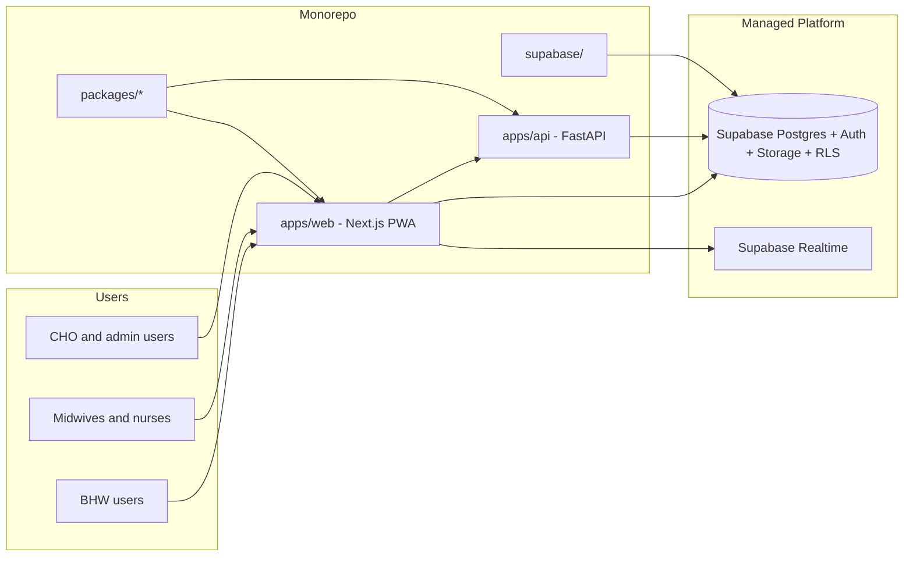
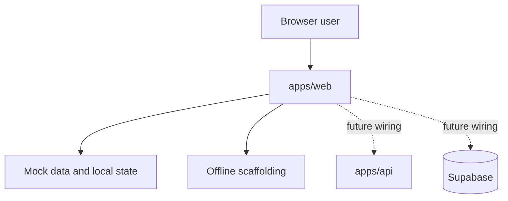

# Project LINK Architecture

## Document Status

- Status: Locked baseline
- Last updated: 2026-04-09
- Companion document: `docs/project-spec.md`

## 1. Architectural Intent

Project LINK is designed as a hybrid web platform with clear service boundaries inside a single monorepo.

This means:

- one repository for coordinated development
- separate app boundaries for frontend and backend responsibilities
- a dedicated Supabase workspace for schema and platform configuration

The architecture must support a frontend-first first phase without forcing a later rewrite when backend and database wiring become real.

## 2. Finalized Repository Structure

```text
apps/
  web/        # Next.js web app and PWA
  api/        # FastAPI service for domain logic
packages/     # shared packages only when justified
supabase/     # migrations, config, policies, seeds
docs/         # product and architecture references
```

## 3. Architecture Model

Project LINK uses:

- a monorepo for code organization
- decoupled runtime responsibilities for production architecture

This is the intended model:

- `apps/web` is the main user-facing application
- `apps/api` is a separate backend service boundary
- `supabase/` is the database and auth configuration boundary

## 4. High-Level Target Architecture



## 5. Phase 1 Architecture

Phase 1 uses the same repo structure as the target system, but only one app is implementation-heavy.

### Active Build Focus

- `apps/web`

### Present but Secondary

- `apps/api`
- `supabase/`
- `packages/*`

### Phase 1 Principle

The project should not wait to invent a "perfect backend" before building the user experience, but it also should not collapse everything into a frontend structure that later fights the production architecture.

## 6. Responsibilities by Boundary

### 6.1 `apps/web`

Owns:

- all role-facing interfaces
- route structure
- dashboards
- forms and local validation
- PWA behavior
- offline scaffolding
- mock data adapters and placeholder integrations for unfinished backend features
- future basic CRUD and frontend-adjacent route handlers where appropriate

Should not own:

- heavy reporting logic
- formal validation-gate orchestration
- final analytics logic
- future ML services

### 6.2 `apps/api`

Owns:

- health data validations
- reporting workflows
- TCL to ST to MCT orchestration
- future GIS-related service logic where needed
- future analytics and ML workloads
- backend-only business rules that should not live in the web app

In Phase 1:

- may be scaffolded
- may expose placeholder contracts
- is not the primary implementation surface

### 6.3 `supabase/`

Owns:

- project configuration
- migrations
- RLS policies
- seed strategy
- auth-related platform setup

In Phase 1:

- can exist with minimal initialization
- should preserve a clean path for later schema and auth work

### 6.4 `packages/*`

Owns:

- shared libraries only when justified
- future shared UI, types, or config packages

In Phase 1:

- optional
- should stay minimal to avoid premature abstraction

## 7. Phase 1 Runtime Shape



## 8. Phase 1 Flow Expectations

Phase 1 should prove:

- users can move through the intended interface per role
- forms and workflow transitions make sense
- the information architecture supports later wiring
- the frontend is not blocked by unfinished backend services

Phase 1 does not need to prove:

- full auth
- full persistence
- final sync mechanics
- final reporting correctness
- final GIS implementation

## 9. Backend Strategy

The backend split is intentional:

- Next.js in `apps/web` may eventually handle simple CRUD or backend-for-frontend routes
- FastAPI in `apps/api` remains the destination for more complex domain logic

This keeps the web app productive without asking it to absorb the full weight of health-domain processing.

## 10. Data and Integration Strategy

The long-term system will integrate with Supabase for:

- database persistence
- authentication
- authorization through RLS
- storage
- possible realtime subscriptions

Phase 1 should prepare for those integrations by:

- using stable feature boundaries
- avoiding UI structures that assume fake-only data forever
- isolating mock data providers so they can be swapped later

## 11. GIS Boundary

GIS is recognized as a future subsystem with existing planning behind it.

At this stage the architecture should only lock:

- GIS exists as a major subsystem
- GIS integrates with validated operational data
- GIS surfaces will appear in `apps/web`
- backend or data logic for GIS may involve `apps/api` and Supabase/PostGIS later

Detailed GIS internals are intentionally deferred.

## 12. Architecture Summary

Project LINK will use a monorepo with this locked structure:

- `apps/web`
- `apps/api`
- `packages/*`
- `supabase/`

Phase 1 is a frontend-first implementation inside that architecture, not a separate throwaway prototype. The repository and service boundaries are being established now so future phases can add real backend logic, database wiring, and GIS/reporting capabilities without re-architecting the project.

